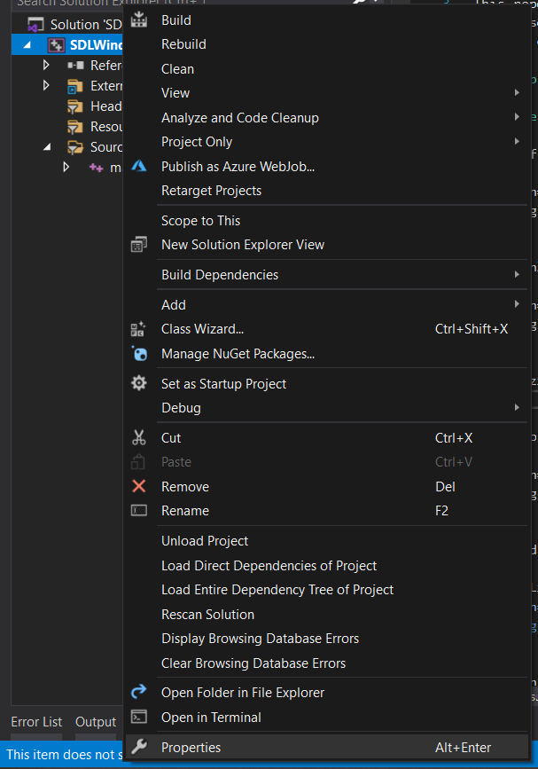

# SDL-Windows-Tutorials

This repo contains some examples and tutorials with SDL on Windows, 
of course you can use this cpp codes on Linux or Mac, although this README.md
doesn't cover how to setup those examples.

## Setup

### Note: Make sure Visual Studio is installed.

First of all go to the [SDL web page](https://www.libsdl.org), go to releases

    

And download the Visual Studio version

    

Also download the [`SDL Image library`](https://www.libsdl.org/projects/SDL_image/), the Visual Studio version in this case.

    

Then **unzip those folders wherever you want**.

Let's go to Visual Studio, create a new `C++` project and then click on propperties

    

Go to `VC++ Directories`, fill the `Include Directories` and the `Library Directories` with the folder path of the folders that you unzipped.

### Note: select `x64` or `x86` deppending of the type of build settings you have or want.

    

Go to `Linker` and click `Additional Library Directories`, then add the `lib` folder of the unzipped folders.

    

Let's go to the `input` section in the `Linker`, and add the following text:

    

And after all we almost got it, maybe in some PC's would work just using the last step, but, if it doesn't work, let's do the following steps.

Go to the `lib` folder of both unzipped folders and paste it to the folder where you are running your project, like this:

    

    

And after that we can get something like this:

We move it with `W`, `A`, `S`, `D`.

    

